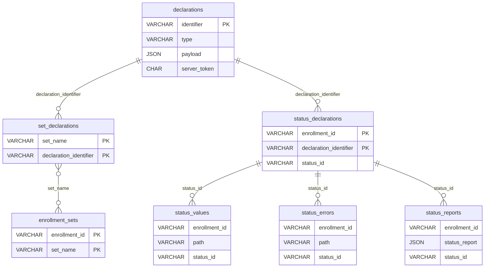

# 数据库结构与 SQL

本文件汇总 KMFDDM 项目 MySQL 存储后端的表结构（DDL）与常用数据操作（DML），并用表格简要描述各表之间的关系。所有 SQL 文件位于 `storage/mysql` 目录下。

## 表结构 (DDL)

以下内容摘自 `storage/mysql/schema.sql`：
```sql
CREATE TABLE declarations (
    identifier VARCHAR(255) NOT NULL,
    type       VARCHAR(255) NOT NULL,
    payload    JSON NOT NULL,

    created_at TIMESTAMP DEFAULT CURRENT_TIMESTAMP NOT NULL,
    updated_at TIMESTAMP DEFAULT CURRENT_TIMESTAMP ON UPDATE CURRENT_TIMESTAMP NOT NULL,
    touched_ct INT DEFAULT 0 NOT NULL,

    -- previously: AS (SHA1(CONCAT(identifier, type, payload, created_at, touched_ct))) STORED 
    -- due to a schema management system this type of column isn't used
    -- despite MySQL supporting it just fine. instead we manually inject the
    -- stored SHA-1 in the SQL in declarations.go.
    server_token CHAR(40) NOT NULL,

    PRIMARY KEY (identifier),

    CHECK (type != ''),
    INDEX (type)
);

CREATE TABLE set_declarations (
    set_name               VARCHAR(255) NOT NULL,
    declaration_identifier VARCHAR(255) NOT NULL,

    PRIMARY KEY (set_name, declaration_identifier),

    CHECK (set_name != ''),
    CHECK (declaration_identifier != ''),

    FOREIGN KEY (declaration_identifier)
        REFERENCES declarations (identifier),

    created_at TIMESTAMP DEFAULT CURRENT_TIMESTAMP NOT NULL,
    updated_at TIMESTAMP DEFAULT CURRENT_TIMESTAMP ON UPDATE CURRENT_TIMESTAMP NOT NULL
);

CREATE TABLE enrollment_sets (
    enrollment_id VARCHAR(255) NOT NULL,
    set_name      VARCHAR(255) NOT NULL,

    PRIMARY KEY (enrollment_id, set_name),

    CHECK (enrollment_id != ''),
    CHECK (set_name != ''),

    created_at TIMESTAMP DEFAULT CURRENT_TIMESTAMP NOT NULL,
    updated_at TIMESTAMP DEFAULT CURRENT_TIMESTAMP ON UPDATE CURRENT_TIMESTAMP NOT NULL
);

CREATE TABLE status_declarations (
    enrollment_id   VARCHAR(255) NOT NULL,

    -- we don't setup a FK here because the reported identifier may be deleted
    -- or otherwise not tracked in our DB.
    declaration_identifier VARCHAR(255) NOT NULL,

    active       BOOLEAN NOT NULL,
    valid        VARCHAR(255) NOT NULL,
    server_token VARCHAR(255) NOT NULL,
    -- technically this is a duplication of the data in the declarations but
    -- because we may get status on declarations we don't know about we should
    -- keep this for posterity. note this is the shorter type and not the full
    -- delcaration type.
    item_type    VARCHAR(255) NOT NULL,

    reasons JSON NULL,

    status_id VARCHAR(255) NULL,

    PRIMARY KEY (enrollment_id, declaration_identifier),

    CHECK (enrollment_id != ''),
    CHECK (declaration_identifier != ''),

    created_at TIMESTAMP DEFAULT CURRENT_TIMESTAMP NOT NULL,
    updated_at TIMESTAMP DEFAULT CURRENT_TIMESTAMP ON UPDATE CURRENT_TIMESTAMP NOT NULL
);

CREATE TABLE status_values (
    enrollment_id   VARCHAR(128) NOT NULL,

    path VARCHAR(255) NOT NULL,
    container_type VARCHAR(6) NOT NULL, -- object|array
    value_type     VARCHAR(7) NOT NULL, -- string|number|boolean
    value VARCHAR(255) NOT NULL,

    status_id VARCHAR(255) NULL,

    INDEX (enrollment_id),
    INDEX (path),
    INDEX (enrollment_id, path),

    -- beware: we can get close to the maximum index size if our columns are too large
    UNIQUE (enrollment_id, path, container_type, value_type, value),

    created_at TIMESTAMP DEFAULT CURRENT_TIMESTAMP NOT NULL,
    updated_at TIMESTAMP DEFAULT CURRENT_TIMESTAMP ON UPDATE CURRENT_TIMESTAMP NOT NULL
);

CREATE TABLE status_errors (
    enrollment_id   VARCHAR(255) NOT NULL,

    path VARCHAR(255) NOT NULL,
    error JSON NOT NULL,

    status_id VARCHAR(255) NULL,
    row_count INT DEFAULT 0 NOT NULL,

    INDEX (enrollment_id),

    created_at TIMESTAMP DEFAULT CURRENT_TIMESTAMP NOT NULL,
    updated_at TIMESTAMP DEFAULT CURRENT_TIMESTAMP ON UPDATE CURRENT_TIMESTAMP NOT NULL,

    INDEX (created_at),
    INDEX (enrollment_id, row_count)
);

CREATE TABLE status_reports (
    enrollment_id   VARCHAR(255) NOT NULL,

    status_report JSON,

    status_id VARCHAR(255) NULL,
    row_count INT DEFAULT 0 NOT NULL,

    INDEX (enrollment_id),

    CHECK (enrollment_id != ''),
    CHECK (status_report != '' AND status_report != 'null'),

    created_at TIMESTAMP DEFAULT CURRENT_TIMESTAMP NOT NULL,
    updated_at TIMESTAMP DEFAULT CURRENT_TIMESTAMP ON UPDATE CURRENT_TIMESTAMP NOT NULL,

    INDEX (created_at),
    INDEX (enrollment_id, row_count)
);
```

## 数据操作 (DML)

`storage/mysql/query.sql` 中包含项目所需的查询和更新语句，主要用于声明和状态相关数据的读取与写入：
```sql
-- name: GetManifestItems :many
SELECT DISTINCT
    d.identifier,
    d.type,
    d.server_token
FROM
    declarations d
    INNER JOIN set_declarations sd
        ON d.identifier = sd.declaration_identifier
    INNER JOIN enrollment_sets es
        ON sd.set_name = es.set_name
WHERE
    es.enrollment_id = ?;

-- name: RemoveAllEnrollmentSets :execresult
DELETE FROM
    enrollment_sets
WHERE
    enrollment_id = ?;

-- name: GetDeclaration :one
SELECT
    d.identifier,
    d.type,
    d.payload,
    d.server_token,
    JSON_OBJECT(
        'Identifier',  d.identifier,
        'Type',        d.type,
        'Payload',     d.payload,
        'ServerToken', d.server_token
    ) AS declaration
FROM
    declarations d
WHERE
    d.identifier = ?;

-- name: GetDDMDeclaration :one
SELECT
    JSON_OBJECT(
        'Identifier',  d.identifier,
        'Type',        d.type,
        'Payload',     d.payload,
        'ServerToken', d.server_token
    ) AS declaration
FROM
    declarations d
    INNER JOIN set_declarations sd
        ON d.identifier = sd.declaration_identifier
    INNER JOIN enrollment_sets es
        ON sd.set_name = es.set_name
WHERE
    d.identifier = ? AND
    es.enrollment_id = ? AND
    d.type LIKE ?;

-- name: RemoveDeclarationStatus :exec
DELETE FROM
    status_declarations
WHERE
    enrollment_id = ?;

-- name: PutDeclarationStatus :exec
INSERT INTO status_declarations (
    enrollment_id,
    item_type,
    declaration_identifier,
    active,
    valid,
    server_token,
    reasons,
    status_id
) VALUES (?, ?, ?, ?, ?, ?, ?, ?);

-- name: GetDeclarationStatus :many
SELECT
    sd.enrollment_id,
    sd.declaration_identifier,
    sd.active,
    sd.valid,
    sd.reasons,
    sd.server_token,
    sd.updated_at,
    sd.status_id,
    sd.server_token = COALESCE(d.server_token, '') AS current
FROM
    status_declarations sd
    LEFT JOIN declarations d
        ON sd.declaration_identifier = d.identifier
    LEFT JOIN set_declarations setd
        ON d.identifier = setd.declaration_identifier
    LEFT JOIN enrollment_sets es
        ON setd.set_name = es.set_name AND sd.enrollment_id = es.enrollment_id
WHERE
    sd.enrollment_id IN (sqlc.slice('ids'))
ORDER BY
    sd.enrollment_id;
```

## 数据库关系简表

| 表名 | 说明 |
|------|------|
| `declarations` | 存储所有声明 JSON，以及计算出的 `server_token` |
| `set_declarations` | 声明与集合（Set）的关联表 |
| `enrollment_sets` | Enrollment 与集合的关联表 |
| `status_declarations` | 设备上声明的状态记录 |
| `status_values` | 状态报告中的键值对明细 |
| `status_errors` | 状态报告中的错误记录 |
| `status_reports` | 完整的原始状态报文存档 |

## 数据库 ER 图

下图展示了数据库各表之间的关系，使用 Mermaid 语法绘制，源文件位于 `docs/db_er_diagram.mmd`：



